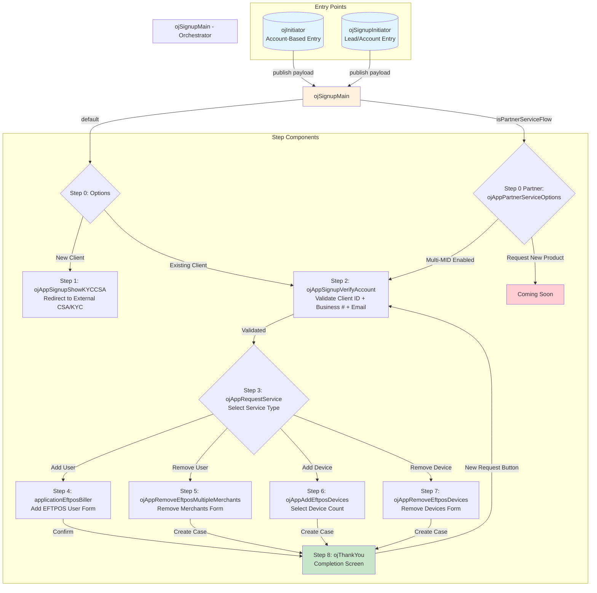
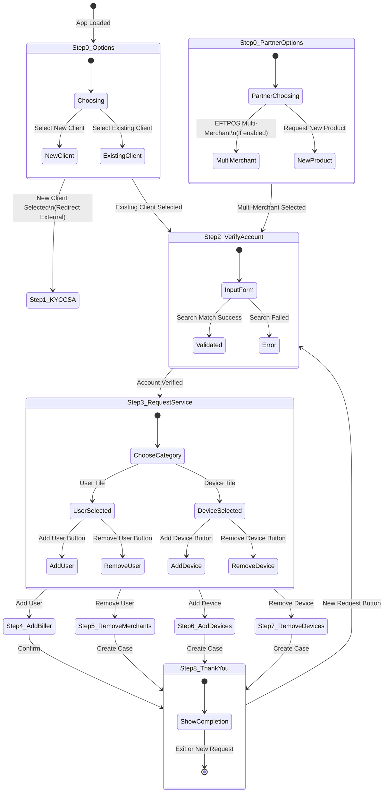
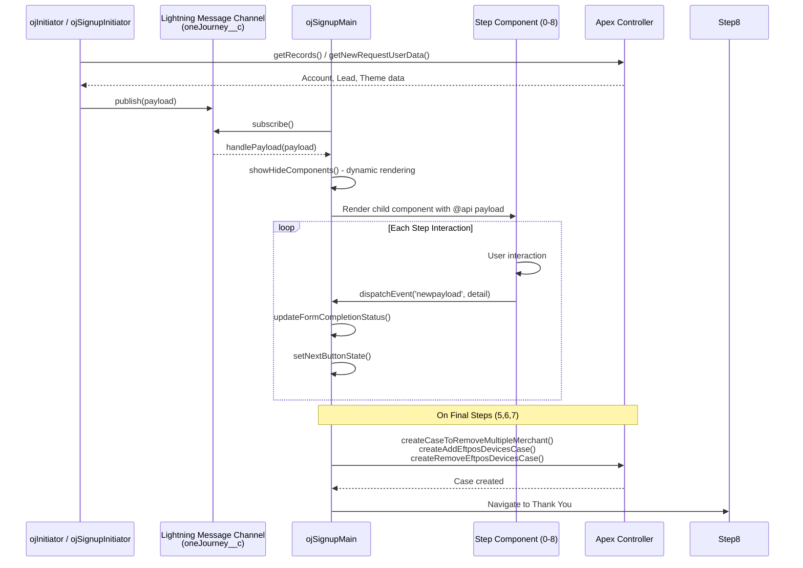

# Services Request LWC - One Journey

A Salesforce Lightning Web Components (LWC) project for managing merchant service requests and client signups. This application provides a multi-step wizard interface for existing merchants to request service changes (add/remove users, devices, merchants) and for new clients to begin the signup process.

## Architecture Overview

The project uses **Lightning Message Service (LMS)** with the `oneJourney__c` message channel for component communication. The `payload` object is passed between components to maintain state throughout the journey.

### Two Main Entry Flows

| Entry Point | Component | Use Case |
|-------------|-----------|----------|
| Service Request | `ojInitiator` | Existing Account-based flow |
| Signup Flow | `ojSignupInitiator` | Lead or Account-based flow (ISV/Partner portal) |

---

## Component Inventory

### Core / Initiator Components

| Component | File | Description |
|-----------|------|-------------|
| **ojInitiator** | [ojInitiator.js](force-app/main/default/lwc/ojInitiator/ojInitiator.js) | Entry point for **Account-based** service requests. Fetches account/application/theme data via Apex (`OJInitiatorCtrl.getRecords`) and publishes initial payload to LMS channel. |
| **ojSignupInitiator** | [ojSignupInitiator.js](force-app/main/default/lwc/ojSignupInitiator/ojSignupInitiator.js) | Entry point for **Signup** flow. Supports both Lead-based (direct signup) and Account-based (ISV Partner Portal) flows. Handles return navigation from Add Merchant page via URL parameters (`pId`, `oppid`, `conid`). |

### Main Container

| Component | File | Description |
|-----------|------|-------------|
| **ojSignupMain** | [ojSignupMain.js](force-app/main/default/lwc/ojSignupMain/ojSignupMain.js) | **Central orchestrator** that subscribes to LMS, manages step navigation (0-8), dynamically renders child components, handles Previous/Next/New Request button logic, and calls Apex methods to create cases on final steps. |

### Step Components (Rendered by ojSignupMain)

| Step | Component | File | Purpose |
|------|-----------|------|---------|
| 0 | **ojAppSignupOptions** | [ojAppSignupOptions.js](force-app/main/default/lwc/ojAppSignupOptions/ojAppSignupOptions.js) | New Client vs Existing Client selection. New clients are redirected to CSA/KYC external page. |
| 0 (Partner) | **ojAppPartnerServiceOptions** | [ojAppPartnerServiceOptions.js](force-app/main/default/lwc/ojAppPartnerServiceOptions/ojAppPartnerServiceOptions.js) | Partner-specific options: EFTPOS Multi-Merchant (if enabled via config) or Request New Payment Product (coming soon). Loads partner config via `getPartnerConfigByAccountId`. |
| 1 | **ojAppSignupShowKYCCSA** | [ojAppSignupShowKYCCSA.js](force-app/main/default/lwc/ojAppSignupShowKYCCSA/ojAppSignupShowKYCCSA.js) | Redirects user to external KYC/CSA page via `window.open()`. |
| 2 | **ojAppSignupVerifyAccount** | [ojAppSignupVerifyAccount.js](force-app/main/default/lwc/ojAppSignupVerifyAccount/ojAppSignupVerifyAccount.js) | Verifies existing client identity by validating **Client ID**, **Business Registration Number**, and **Requester Email** against backend via `searchExistingBiller`. Returns EFTPOS/Multi-MID status. |
| 3 | **ojAppRequestService** | [ojAppRequestService.js](force-app/main/default/lwc/ojAppRequestService/ojAppRequestService.js) | **Service selection screen**. User chooses a category: **User** (Add/Remove) or **Device** (Add/Remove), then selects the specific action. Determines which step comes next. |
| 4 | **applicationEftposBiller** | [applicationEftposBiller.js](force-app/main/default/lwc/applicationEftposBiller/applicationEftposBiller.js) | **Add EFTPOS User/Biller** form. Collects Trading Name, First Name, Last Name, Email, Phone. Supports add/edit/delete users, prefill toggle, and email uniqueness validation. Calls `addEftposUser`, `editEftposUser`, `deleteEftposUser`, `getEftposUsers` Apex methods. |
| 5 | **ojAppRemoveEftposMultipleMerchants** | [ojAppRemoveEftposMultipleMerchants.js](force-app/main/default/lwc/ojAppRemoveEftposMultipleMerchants/ojAppRemoveEftposMultipleMerchants.js) | **Remove Multiple Merchants** form. Dynamic list of merchants to remove with Trading Name, Email, Client ID fields per row. Supports add/edit/delete rows. |
| 6 | **ojAppAddEftposDevices** | [ojAppAddEftposDevices.js](force-app/main/default/lwc/ojAppAddEftposDevices/ojAppAddEftposDevices.js) | **Add EFTPOS Devices** selection. Simple dropdown to select number of devices (1-20). |
| 7 | **ojAppRemoveEftposDevices** | [ojAppRemoveEftposDevices.js](force-app/main/default/lwc/ojAppRemoveEftposDevices/ojAppRemoveEftposDevices.js) | **Remove EFTPOS Devices** form. Dynamic list with Serial Number, Reason for Removal (Faulty/Swollen Battery/Other + description). Supports multiple device entries. |
| 8 | **ojThankYou** | [ojThankYou.js](force-app/main/default/lwc/ojThankYou/ojThankYou.js) | Completion/thank you screen. Displays brand-specific images. Offers "New Request" button to restart the flow from Step 2. |

### UI / Layout Components

| Component | File | Description |
|-----------|------|-------------|
| **ojHeader** | [ojHeader.js](force-app/main/default/lwc/ojHeader/ojHeader.js) | Global header displaying partner logo, phone icon with click-to-call support, and branded styling. Subscribes to LMS for payload. |
| **ojFooter** | [ojFooter.js](force-app/main/default/lwc/ojFooter/ojFooter.js) | Global footer with company name, copyright year, Privacy Policy & Terms of Use links. Collapsible on mobile. |
| **csaapplicationFooter** | [csaapplicationFooter.js](force-app/main/default/lwc/csaapplicationFooter/csaapplicationFooter.js) | Navigation footer for the application screens with Previous/Next buttons and "Add Another Biller" link. Handles branding (Ezidebit/eWay/Global). |
| **ojProgressBarVertical** | [ojProgressBarVertical.js](force-app/main/default/lwc/ojProgressBarVertical/ojProgressBarVertical.js) | Vertical progress indicator for multi-step journeys. |
| **ojProgressbarHorizontal** | [ojProgressbarHorizontal.js](force-app/main/default/lwc/ojProgressbarHorizontal/ojProgressbarHorizontal.js) | Horizontal progress bar showing completed/current/upcoming stages with SVG icons. Used in bank details update flow. |

### Utility Components

| Component | File | Description |
|-----------|------|-------------|
| **ojUtil** | [ojUtil.js](force-app/main/default/lwc/ojUtil/ojUtil.js) | Shared utility module: CSS property injection, font setting, resource URL helpers, step/field configuration getters. Imports from [constant.js](force-app/main/default/lwc/ojUtil/constant.js). |
| **constant.js** | [constant.js](force-app/main/default/lwc/ojUtil/constant.js) | Defines step configurations for both **Bank Details Update** flow (7 steps) and **Signup** flow (3 steps), plus required Salesforce field lists for Account/Lead/Theme objects. |
| **applicationCSSLibrary** | [applicationCSSLibrary.css](force-app/main/default/lwc/applicationCSSLibrary/applicationCSSLibrary.css) | Shared CSS styles for the application. |

---

## Application Flow Diagram



---

## Detailed Navigation Logic



---

## Communication Pattern



---

## Key Technologies

- **Salesforce LWC** (Lightning Web Components)
- **Lightning Message Service (LMS)** for cross-component communication
- **Apex Controllers**: `OJInitiatorCtrl`, `BillerMatchController`, `EftposUserController`, `OnboardingCaseCtrl`
- **Dynamic Component Rendering** via `lwc:dynamic` in ojSignupMain
- **Theme Engine**: Runtime CSS property injection from custom metadata (Theme object)
- **Branding Support**: Ezidebit, eWay, Global Payments brands with configurable colors/fonts/logos

---

## Project Structure

```
force-app/main/default/lwc/
├── applicationCSSLibrary/          # Shared CSS
├── applicationEftposBiller/         # Step 4: Add EFTPOS User
├── csaapplicationFooter/            # Navigation footer
├── ojAppAddEftposDevices/           # Step 6: Add Devices
├── ojAppPartnerServiceOptions/      # Step 0 (Partner): Service Options
├── ojAppRemoveEftposDevices/        # Step 7: Remove Devices
├── ojAppRemoveEftposMultipleMerchants/ # Step 5: Remove Merchants
├── ojAppRequestService/             # Step 3: Service Selection
├── ojAppSignupOptions/              # Step 0: New/Existing Client
├── ojAppSignupShowKYCCSA/           # Step 1: KYC/CSA Redirect
├── ojAppSignupVerifyAccount/        # Step 2: Verify Account
├── ojFooter/                        # Global Footer
├── ojHeader/                        # Global Header
├── ojInitiator/                     # Entry: Account Flow
├── ojProgressBarVertical/           # Vertical Progress Bar
├── ojProgressbarHorizontal/         # Horizontal Progress Bar
├── ojSignupInitiator/               # Entry: Signup Flow
├── ojSignupMain/                    # Main Orchestrator
├── ojSignupUtils/                   # Utilities + Constants
│   ├── constant.js                  # Step definitions & field configs
│   ├── ojSignupFields.js            # Field definitions
│   └── ojUtil.js                    # Shared utility functions
├── ojThankYou/                      # Step 8: Completion
└── ojUtil/                          # Utility module
    ├── constant.js
    └── ojUtil.js
```
